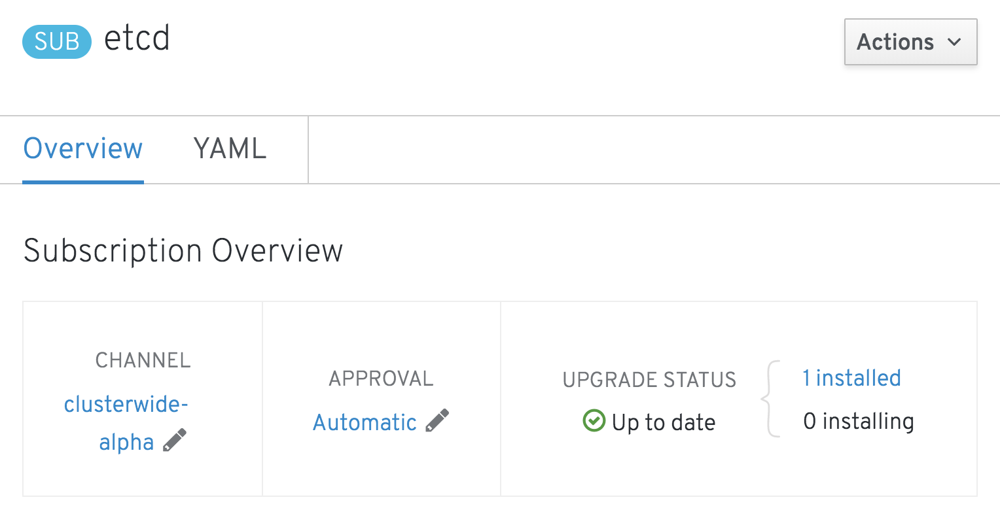

In this first set of exercises you will install an `etcd` cluster into your project. You will do this by using an operator for `etcd`.

Before we can get started, we need to check that the `etcd` operator has been enabled and is setup to monitor all namespaces in the cluster. If it hasn't we will enable it from the OperatorHub.

To get the the OperatorHub in the web console first click on the "Console" tab in the workshop environment to bring up the web console in place of the terminal.

Now click on "Catalog->OperatorHub" in the left hand menu of the web console. If the left hand menu is not visible, you can expose it by clicking on the hamburger menu on the left side of the web console banner. Alternatively click on this [OperatorHub](%console_url%/operatorhub)&nbsp; link.

Scroll down until you find the "Filter by keyword..." text box and enter `etcd`. This should restrict the list of operators to just that for `etcd`.

If the card for `etcd` shows the operator as already installed, check with the workshop instructor as to what to do.

Click on the `etcd` card. This may result in a popup window being shown warning that this is a community supported operator. Click on "Continue".

When you click through, you should see a popup which provides details on the `etcd` operator.

Ensure that the operator version mentions "clusterwide". Then click "Install". This will bring up a page where you can create a subscription for the `etcd` operator. Creating the subscription is what enables the operator and makes it available to users.

On this page, ensure that the "Installation mode" is set to "All namespaces on the cluster". If it doesn't, click on "clusterwide-alpha" under "Update channel", and then click on "All namespaces on the cluster" if not already selected.

When the operators are correct, click on "Subscribe". On the next page, wait until the page is updated to show "1 installed".

Return back to the list of projects by selecting "Home->Projects" in the menu.
