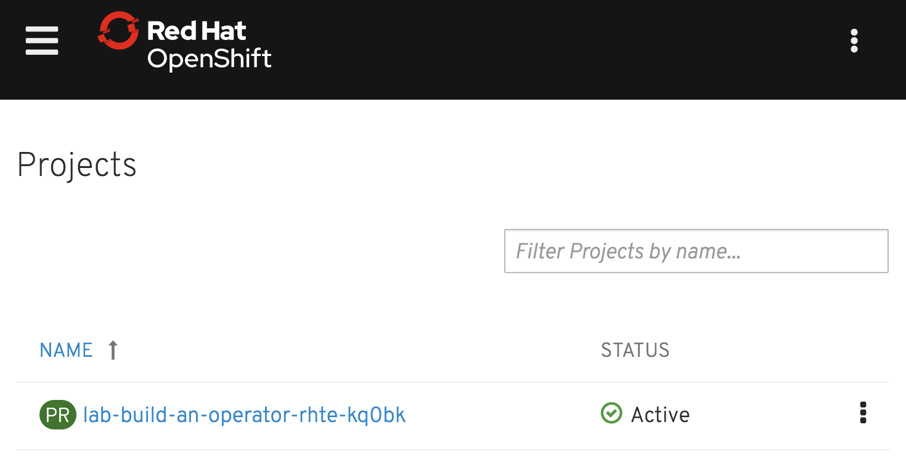
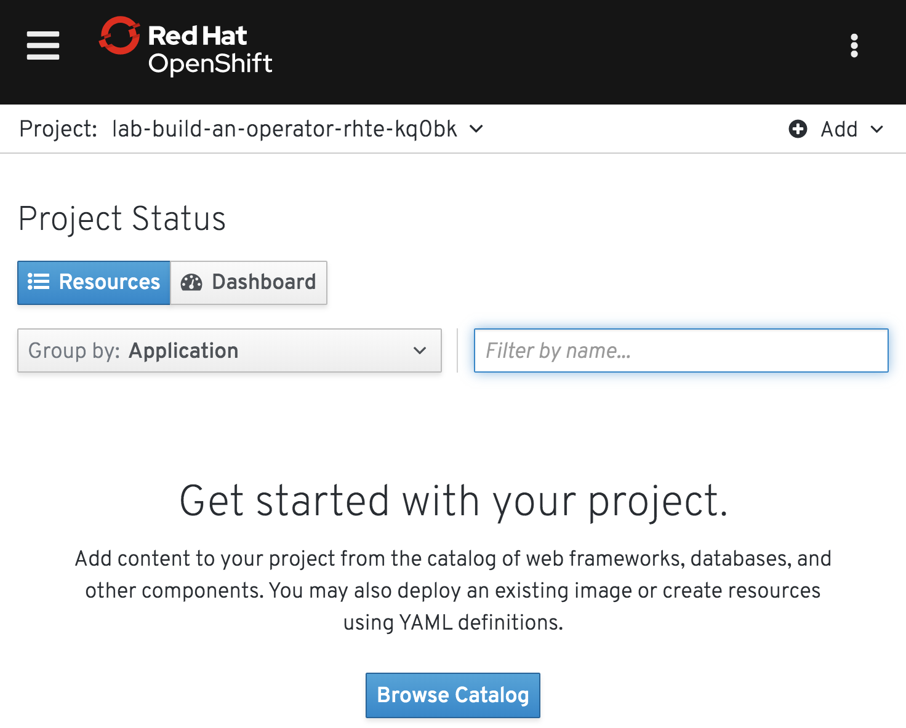
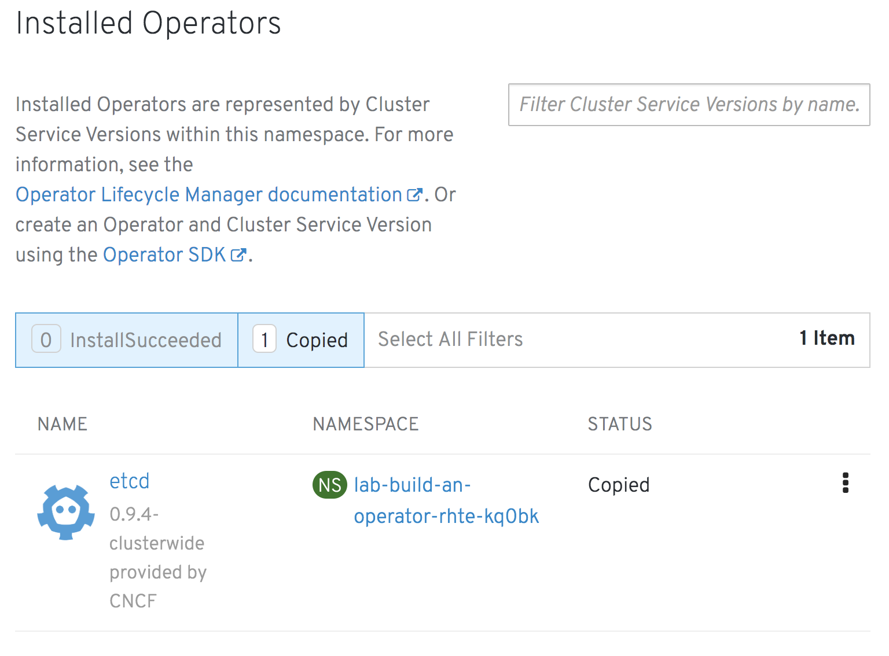

To see what operators may already have been installed into a cluster and which are available for you to use in your project, you can view them by visiting "Installed Operators" in the web console.

Right now you should be on the list of projects you have access to.



When accessing the web console as a cluster admin, you will see all projects in the cluster, and not just the project created for this workshop session.

With the list of projects visible, it is important to click on the name of the project provided to you for this workshop, so that the web console uses it as the context for subsequent steps. If the project list includes all projects in the cluster, copy the project name:

```copy
%project_namespace%
```

into the "Filter Project by name..." text box to limit the list to showing just your project, so you can then click on it.

This should bring you to the [overview](%console_url%/overview/ns/%project_namespace%)&nbsp;<span class="fas fa-window-restore"></span> page for the project.



Now select "Catalog->Installed Operators" from the left hand menu. This should bring up the list of [installed operators](%console_url%/k8s/ns/%project_namespace%/clusterserviceversions)&nbsp;<span class="fas fa-window-restore"></span>.



It is possible that you may see other operators which have been enabled and are available. It will depend on what the cluster admin has previously setup.

The list of installed operators, and what you can do with them through the web console, is determined from the instances of the `clusterserviceversion` resources which exist in a project. You can query them from the command line by running:

```execute
oc get clusterserviceversions
```
