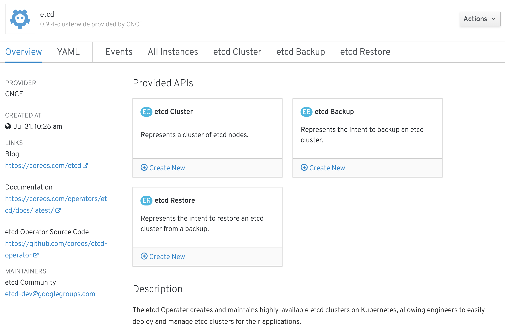
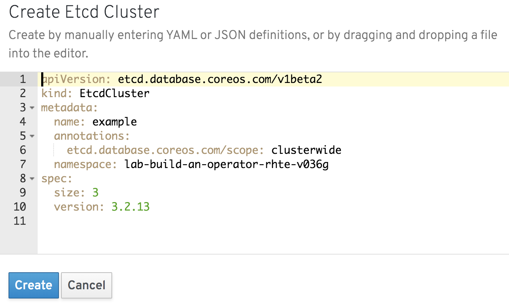
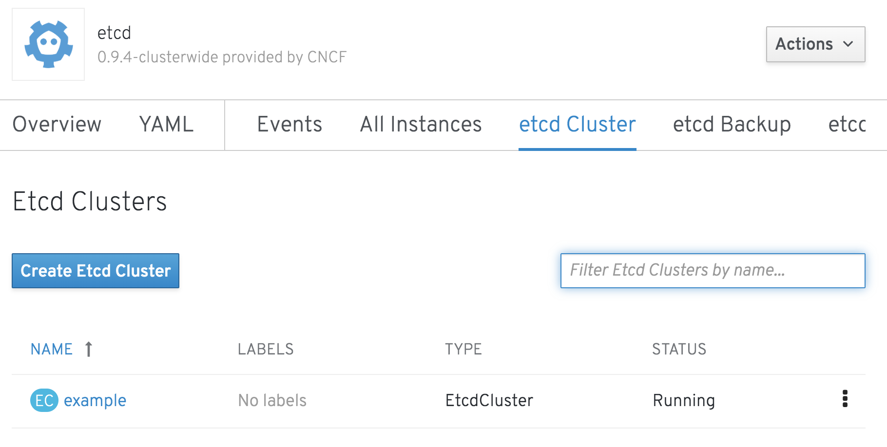
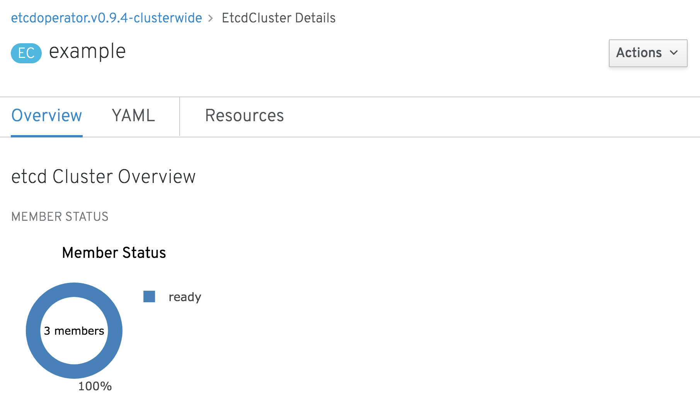

From the list of [installed operators](%console_url%/k8s/ns/%project_namespace%/clusterserviceversions)&nbsp;, find the `etcd` entry. If you have a large list of operators available to you, enter `etcd` into the "Filter Cluster Service Versions by name" text box. Click on the entry for `etcd`. This should bring up a description of the `etcd` operator.

Much of the information in this page of the web console is generated from the `clusterserviceversion` resource object for the `etcd` operator. This includes some instructions about using `etcd`, but more importantly lists the options you have for creating a new `etcd` cluster, or tasks for backing up or restoring an existing `etcd` cluster managed by the `etcd` operator.

You can browse through the YAML definition of the `clusterserviceversion` for the `etcd` operator by selecting on the "YAML" tab. When done looking, return back to the "Overview" tab.

At this point, double check that the web console shows you as being in the `%project_namespace%` project, and not some other project. The name of the project is displayed on a project drop down menu just below the top banner of the web console. Select the correct project from the drop down menu if necessary.

To create a new `etcd` cluster from this page in your project, now click on "Create New" of the "etcd Cluster" card under "Provided APIs". You can also get there by clicking on the "etcd Cluster" tab and then clicking on the "Create etcd Cluster" button.

This will bring up an editor on a pre-filled YAML definition for a custom resource, which when created, will in turn trigger the creation of the `etcd` cluster.

The name of the custom resource in this case is `EtcdCluster`. It is one of three custom resource types the `etcd` operator responds to. The others are `EtcdBackup` and `EtcdRestore`, corresponding to those same tasks as you saw listed in the "Overview" page for the `etcd` operator in the web console.

Leave the pre-filled YAML definition as is and click on "Create".

In this case, the YAML definition used the value `example` for `metadata.name`. This means the name of the `EtcdCluster` resource created will be called `example`, but this name will also be used in the resources created for the `etcd` cluster which will in turn be created.

Upon clicking "Create", you should be returned to the "etcd Cluster" tab, where you can see a list of the `etcd` clusters which have been created.

Click on "example" in the list, being for the `etcd` cluster you just created. This should bring you to the page giving details on this specific `etcd` cluster.

The animation for "Member Status" should update as the number of member instances in the cluster are started up and become available. If it doesn't update, keep clicking on the "Overview" tab to force it to update the display. When the complete `etcd` cluster is up and running it should show shows 3 members. This corresponds to the value 3 for `spec.size` in the YAML definition when you created the `etcd` cluster.
