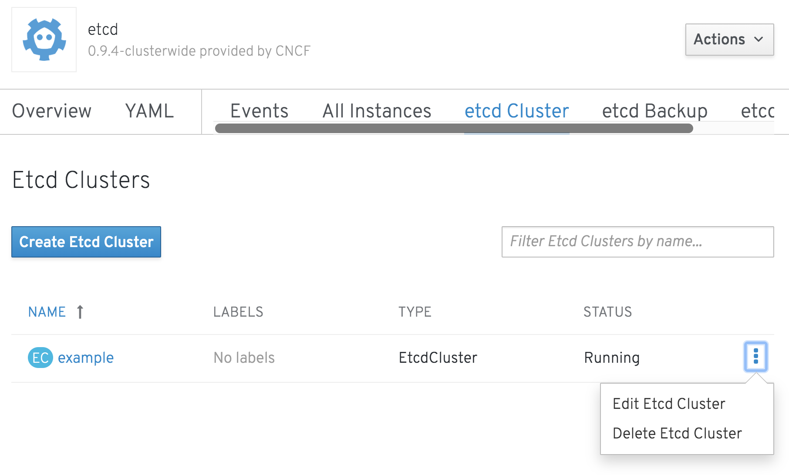

To delete the cluster, from the details page for the `etcd` cluster called `example`, select "Delete Etcd Cluster" from the "Actions" drop down menu.

You can alternatively delete it from kebab menu when viewing the list of `etcd` clusters under the 'etcd Cluster' tab for the `etcd` operator.

Select one of these now and delete the `etcd` cluster called `example`. You will be prompted to confirm that you want to delete the `etcd` cluster. Click on `Delete`.

You should be returned to the list of `etcd` clusters, which should now be empty.

What this has done is delete the `EtcdCluster` resource called `example`. That will in turn trigger the `etcd` operator to delete the deployment of the cluster. This is because the reconciliation process will deem that you no longer want the cluster by virtue of deleting the `EtcdCluster` resource.
