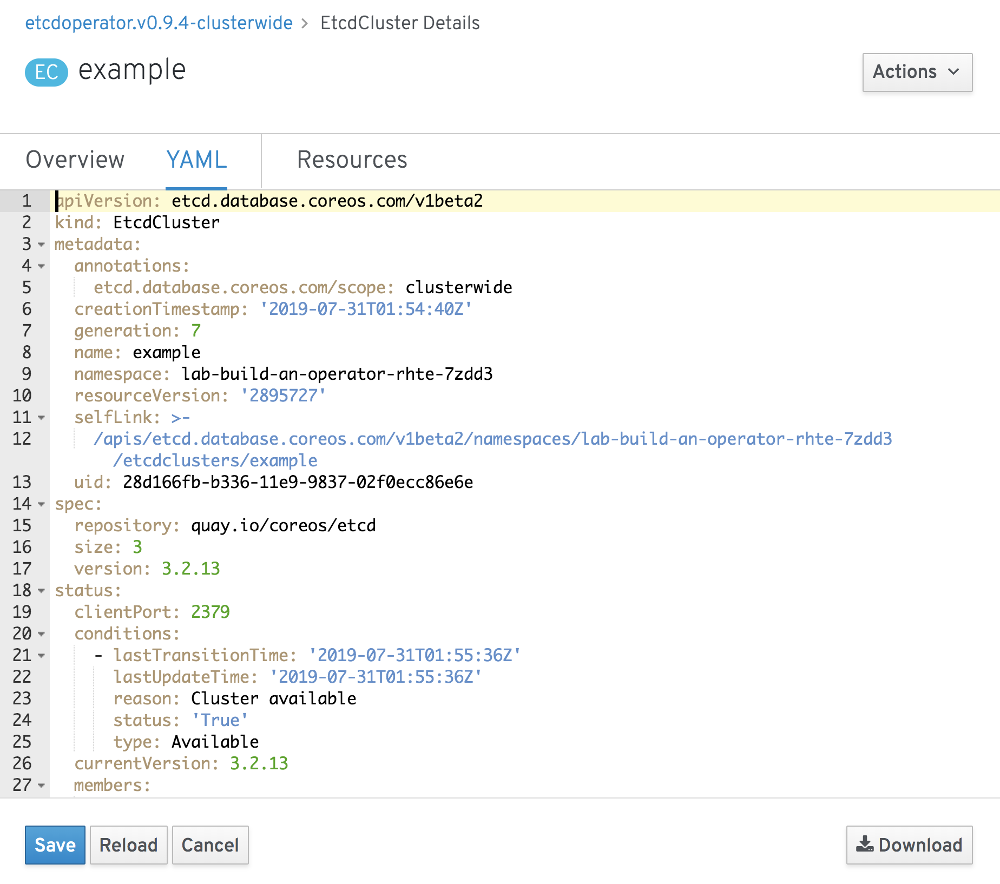

If at any point you want to update details of the deployment, such as changing the number of instance members in the cluster, you need to edit the instance of the `EtcdCluster` custom resource you created.

From the `etcd` cluster details page for your `example` cluster, click on the "YAML" tab, or select "Edit Etcd Cluster" from the "Actions" drop down menu. You should once again find yourself in the YAML editor, but this time you will see that there is a lot more information included in the YAML definition of the `EtcdCluster` instance. This is because it is the live resource definition for your cluster, with it having being filled out with extra information by the `etcd` operator.

One of the extra parts added to the YAML definition is the `status`. This is used by the `etcd` operator to report the current state of the `etcd` cluster and can be helpful in debugging issues with an operator. You should not modify anything under the `status` section. Edits should be restricted to the `spec` section.

To change the number of instance members in the `etcd` cluster, edit the `spec.size` field. This should currently be set to 3. This field should always be an odd number to ensure the correct operation of the `etcd` cluster. For fault tolerance, it should be a minimum of 3.

In a development environment, unless specifically wanting to test fault tolerance, you can get away with setting the size to 1.

Change the value of `spec.size` from 3 to 1 and click on "Save". Return to the "Overview" tab. Keep clicking on the "Overview" tab to refresh the view if necessary. You should see the number of instance members in the cluster being reduced down to 1.

From this you can see how the `etcd` operator manages the cluster based on the definition of the `EtcdCluster` instance for your `example` cluster. You will often hear this being referred to as a reconciliation process. That is, the operator will constantly monitor the custom resources, and when a change is made, it will reconcile any difference between what the custom resource specifies and what any resources created corresponding to the custom resource look like at that time. If there is a mismatch with respect to what you want as defined by the custom resource, the operator will make changes to the resources so they agree.
